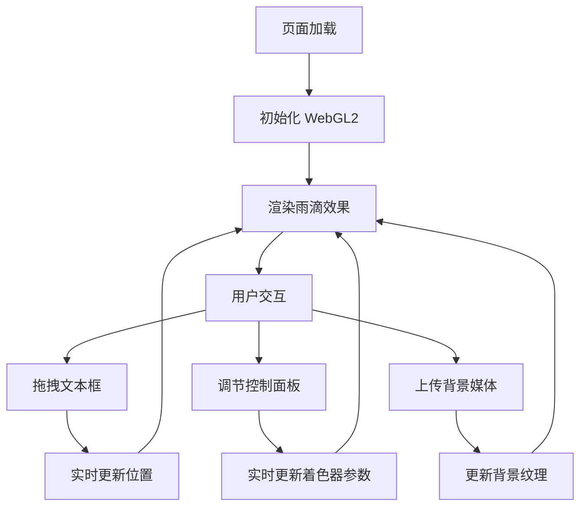

## 1. 产品概述
基于 WebGL2 的玻璃雨滴折射效果单文件 Web 应用，移植 Shadertoy 经典 "Heartfelt" 效果并扩展交互功能。
- 核心价值：展示实时 WebGL2 图形渲染能力，提供可交互的雨滴视觉效果
- 目标用户：前端开发者、图形学爱好者、设计从业者

## 2. 核心特性

### 2.1 功能模块
1. **全屏 WebGL2 渲染画布**：实时雨滴折射效果渲染
2. **折叠式控制面板**：右上角可展开/收起的参数调节面板
3. **悬浮拖拽文本框**：可自由拖动位置的文字展示框
4. **背景媒体上传**：支持上传图片或视频替换默认背景

### 2.2 页面详情
| 页面名称 | 模块名称 | 功能描述 |
|-----------|-------------|---------------------|
| 主页面 | WebGL2 渲染画布 | 全屏雨滴折射效果，双色渐变流体背景 |
| 主页面 | 控制面板 | 雨势强度、雾气浓度、折射率、雨滴大小等参数调节 |
| 主页面 | 悬浮文本框 | 可拖拽移动，展示标题和说明文字 |
| 主页面 | 媒体上传 | 支持图片/视频上传，实时替换背景纹理 |

## 3. 核心流程
用户打开页面 → 展示默认雨滴效果与渐变背景 → 可拖拽文本框调整位置 → 展开控制面板调节参数 → 可上传图片/视频替换背景 → 实时预览效果变化

## 4. 用户界面设计

### 4.1 设计风格
- **主色调**：深色半透明玻璃拟态风格，与雨滴效果呼应
- **辅助色**：青蓝色系渐变，呼应水滴折射的光学效果
- **字体**：现代无衬线字体，清晰易读
- **控制面板**：毛玻璃效果（backdrop-filter），圆角设计
- **悬浮文本框**：半透明背景，带阴影和边框，可拖拽

### 4.2 页面设计概览
| 页面名称 | 模块名称 | UI 元素 |
|-----------|-------------|-------------|
| 主页面 | WebGL2 画布 | 全屏铺满，z-index 最低 |
| 主页面 | 控制面板 | 右上角固定，折叠/展开动画，毛玻璃背景 |
| 主页面 | 悬浮文本框 | 初始居中偏上，可拖拽，带拖拽手柄提示 |
| 主页面 | 上传按钮 | 控制面板内，文件选择器 |

### 4.3 响应式
- 桌面端优先设计
- 控制面板在移动端调整宽度
- 悬浮文本框支持触摸拖拽

### 4.4 WebGL 场景指引
- **背景**：双色渐变流体动画（类似 Shadertoy 流体效果）
- **雨滴层**：多层雨滴粒子系统，包含大小、速度、折射计算
- **后处理**：雾气效果、折射畸变、高光反射
- **性能目标**：60fps（桌面端），30fps+（移动端）
