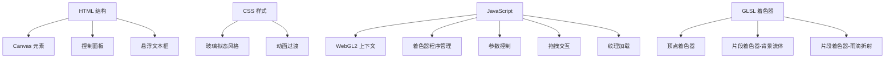

## 1. 架构设计
单文件 HTML 应用，所有代码内联在 index.html 中，包含 HTML 结构、CSS 样式、JavaScript 逻辑和 GLSL 着色器。



## 2. 技术描述
- **前端技术栈**：原生 HTML5 + CSS3 + JavaScript (ES2020) + WebGL2
- **无外部依赖**：单文件零依赖，直接浏览器运行
- **着色器语言**：GLSL ES 3.00（WebGL2 标准）

### 核心技术点
1. **WebGL2 渲染管线**：使用两个着色器程序（背景流体 + 雨滴合成）或单个组合片段着色器
2. **雨滴粒子系统**：在 GPU 中通过噪声函数生成动态雨滴，模拟大小、位置、速度变化
3. **折射计算**：基于雨滴法线对背景纹理坐标进行偏移，模拟玻璃折射效果
4. **双色流体背景**：使用 Simplex 噪声或值噪声生成流动渐变效果
5. **雾气效果**：基于深度/距离的雾化混合，增强空间感

## 3. 文件结构
单文件架构，所有内容内联：
```
/workspace/
└── index.html          # 主文件（包含 HTML/CSS/JS/GLSL）
```

## 4. WebGL2 技术细节

### 4.1 着色器架构
采用**双通道单着色器**架构，在一个片段着色器中完成：
1. 计算背景流体颜色
2. 生成雨滴层（位置、大小、法线）
3. 基于雨滴法线进行折射采样
4. 合成雾气、高光等后期效果

### 4.2 Uniform 变量
| 变量名 | 类型 | 说明 |
|--------|------|------|
| `uTime` | float | 时间，用于动画 |
| `uResolution` | vec2 | 画布分辨率 |
| `uRainIntensity` | float | 雨势强度 (0.0-1.0) |
| `uFogDensity` | float | 雾气浓度 (0.0-1.0) |
| `uRefraction` | float | 折射率 (0.5-2.0) |
| `uDropSize` | float | 雨滴大小系数 (0.5-2.0) |
| `uBackgroundTex` | sampler2D | 背景纹理（可选） |
| `uUseBackground` | float | 是否使用自定义背景 (0/1) |

### 4.3 雨滴算法
- 使用多层哈希噪声生成雨滴位置
- 每个雨滴计算：圆心、半径、高度场、法线
- 折射偏移 = 法线.xy * 折射率 * 雨滴强度
- 高光 = 菲涅尔反射 + 环境光反射

## 5. 交互实现

### 5.1 控制面板
- CSS `transform` + `transition` 实现折叠动画
- 滑块控件实时更新 uniform 变量
- 文件输入控件处理图片/视频上传

### 5.2 拖拽文本框
- 鼠标/触摸事件监听（mousedown/touchstart → mousemove/touchmove → mouseup/touchend）
- 记录偏移量，更新元素 `transform: translate(x, y)`
- 边界检测，防止拖出视口

### 5.3 背景纹理上传
- 图片：`FileReader` + `Image` 对象 → WebGL 纹理
- 视频：`video` 元素 + 定时 `texImage2D` 更新纹理
